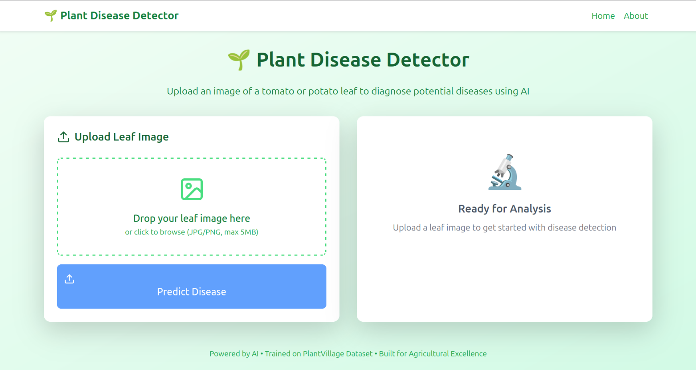
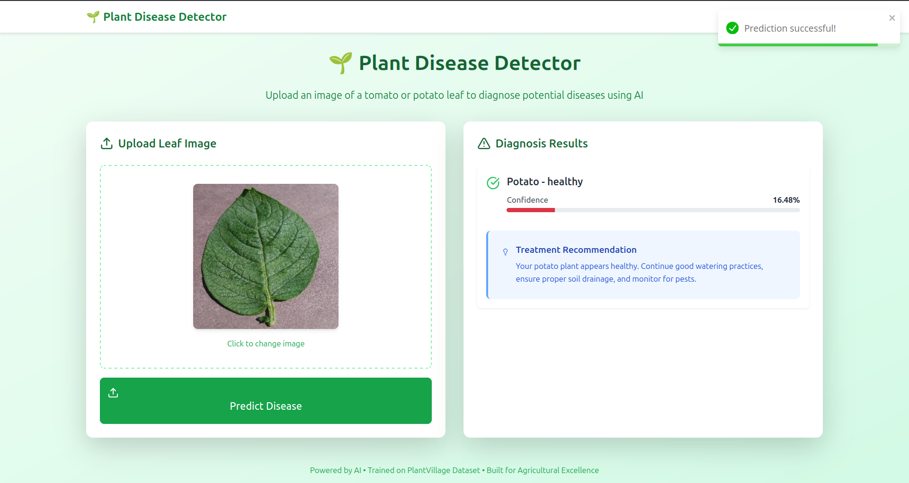

# Plant Disease Detector (Prototype)

A React web app for diagnosing tomato and potato leaf diseases via image uploads, integrated with a Flask backend API.

## Project Overview

This application enables users to upload images of tomato or potato leaves to identify diseases, view confidence scores, and receive treatment suggestions. Built with React and Vite, it connects to a Flask backend on Render, using a TensorFlow Lite model trained on the PlantVillage dataset (~90.5% accuracy).

## Features

- Upload JPG/PNG leaf images (max 5MB)
- Predict diseases with confidence scores (e.g., "Potato - Early Blight")
- Display treatment suggestions
- Responsive UI for desktop and mobile
- Error handling for invalid files or API issues

## Tech Stack

- **Frontend**: React, Vite, TypeScript, Axios, React-Bootstrap
- **Backend** (separate): Flask, TensorFlow Lite, OpenCV
- **Deployment**: Vercel (frontend), Render (backend)
- **Dataset**: PlantVillage

## Impact

This project empowers farmers and gardeners by providing an accessible tool to detect plant diseases early, reducing crop losses and promoting sustainable farming. It supports agricultural education by offering students and researchers a practical application of AI in agriculture, potentially improving food security in regions reliant on tomato and potato crops.

## Links

- **Live App**: [https://leaf-detective-plant-ai.vercel.app/](https://leaf-detective-plant-ai.vercel.app)
